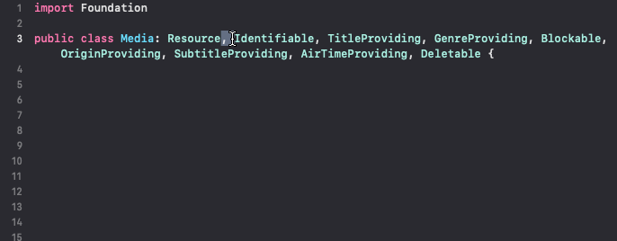

# Xcode Extensions

## Installation

- Download the .app in [releases](https://github.com/hlung/XcodeExtensions/releases) page
- Run the app once, then close it
- Open Xcode, open some .swift file
- The command should appear at the bottom of Editor menu

To uninstall, go to System Preferences > Extension > Xcode Source Editor. Drag the extension into the bin.

## Commands

### Expand Selection

This command uses the selected text to expand selection to the next occurance of that text. This allows fast multi-selection refactoring of any text.

This is the same feature as Sublime Text's `Selection > Expand Selection to Word` (cmd+D) command.

#### Limitation

- Not yet working with a selection that spans across multiple lines.